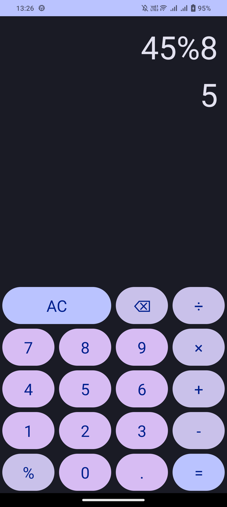
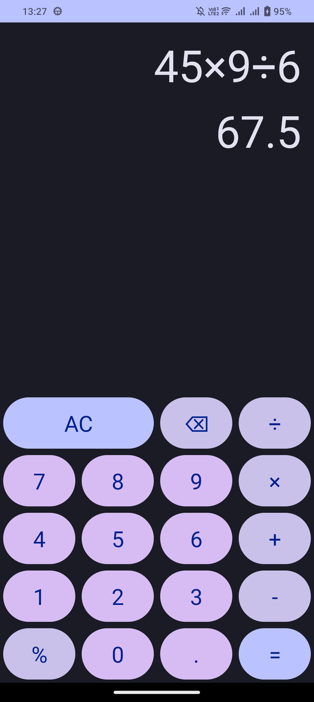

# KotlinCalculatorApp

KotlinCalculatorApp is a simple calculator application I developed using Kotlin to keep my Android development skills sharp and up-to-date. It's a small side project I developed in my spare time, aiming to provide a clean and intuitive calculator experience on Android devices.

## Screenshots

    &nbsp;&nbsp;&nbsp; 
    

## Features

- **Basic Arithmetic Operations:** Perform addition, subtraction, multiplication, and division with ease.
- **Percentage Calculation:** Quickly calculate percentages for various purposes.
- **Clear and Delete Functionality:** Clear the input or delete the last character with the provided buttons.
- **Error Handling:** Proper error handling ensures smooth user experience even with complex expressions.
- **Unit tests:** Init tests to ensure the correctness of calculation functions.
- **UI/Integrated tests:** Integrated tests to validate the user interface and integration of components.

## Code Design

The codebase of KotlinCalculatorApp is designed to be modular and maintainable. Here are some key design aspects:

- **Compose UI:** The user interface is built using Jetpack Compose, offering a modern and reactive approach to UI development on Android.
- **Material 3 Design:** The app follows Material 3 Design guidelines to ensure a visually pleasing and consistent user experience across different devices.
- **mXparser Integration:** The app utilizes the mXparser library for math expression parsing, avoiding reinventing the wheel and ensuring accurate calculation results.

## Understanding '%' Operator in KotlinCalculatorApp

The `solveExpression` function treats expressions ending with "%" as percentages, while others are interpreted as modulo operations. However, this can lead to unexpected behavior in certain cases.

Consider "20%÷2":
1. "20%2" usually means taking 20% of 2, resulting in 0.40.
2. Dividing 0.40 by 2 yields 0.20, not 0.10.

This discrepancy arises from the interpretation of "%" in combination with other operators, showcasing a potential inconsistency in calculator behavior. KotlinCalculatorApp consistently interprets "%" as a percentage regardless of context, ensuring predictable behavior.

It's worth noting that different calculators may interpret expressions differently. For example, if a different calculator yields 0.10 instead of 0.20 for the expression "20%÷2", it may be interpreting the expression in a manner different from the standard interpretation described above. Such variations highlight the importance of understanding the conventions of the specific calculator you are using.

Inputting expressions like "20%÷2" directly into KotlinCalculatorApp may cause a crash due to its strict interpretation. Future updates will address this issue. While this approach guarantees consistency, it's important to note differences from other calculator designs.

## Getting Started

To run KotlinCalculatorApp locally, follow these steps:

1. Clone this repository.
2. Open the project in Android Studio or any compatible IDE.
3. Build and run the project on an Android device or emulator.

## Contribution

Contributions to KotlinCalculatorApp are welcome! If you have any suggestions, enhancements, or bug fixes in mind, feel free to open an issue or submit a pull request.

---

Enjoy calculating with KotlinCalculatorApp! If you have any questions or feedback, don't hesitate to reach out.
